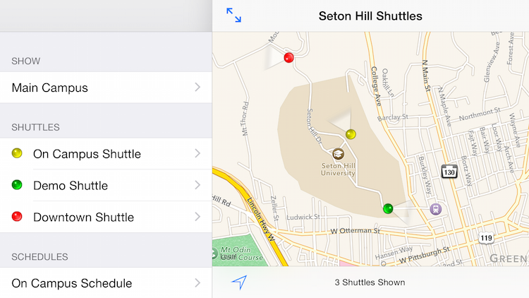

# Seton Hill University Shuttle Tracker #

A universal iPhone / iPad shuttle tracker app written in Swift.

### Features ###
* Shows shuttle locations on a map, along with the directions they're facing.
* Shows names and subtitles in a table view, allowing selection on map.
* Links to shuttle schedules (shown in a web view for easy end-user administration).
* Map type selector control.
* Several remotely-settable configuration variables for easy customization (e.g. data refresh interval, map center, shuttle animation duration).

### Release Status ###
This app is available [on the App Store as Seton Hill Shuttle Tracker](https://itunes.apple.com/us/app/seton-hill-shuttle-tracker/id935409158?mt=8).

### How does it work? ###
Every five seconds, the app performs an HTTP request from a remote server for JSON-serialized data describing the university's shuttle bus locations. The devices are indicated on the screen as colored dots and their movements are animated across the screen.

### Goals ###

* Gain familiarity with current iOS development tools, including Swift, storyboards, and AutoLayout
* Well-documented code that's easy to understand
* Easy to use interface with minimal deviation from established, user-familiar design patterns

### Included third-party frameworks ###

* [MBProgressHUD](https://github.com/jdg/MBProgressHUD)
* [Reachability](https://github.com/tonymillion/Reachability)
* [Alamofire](https://github.com/Alamofire/Alamofire)
* [UIColor-Hex-Swift](https://github.com/yeahdongcn/UIColor-Hex-Swift)

### License ###

Feel free to use this for your own project except:

* The app icon, which is specific to Seton Hill.
* Any Seton Hill-specific verbiage in the app (e.g. "Seton Hill Shuttles").

Obviously I cannot be held liable for however anyone else decides to use this and I provide no warranty (express or implied).

### Contact information ###

Benn Linger

benn@linger.com
